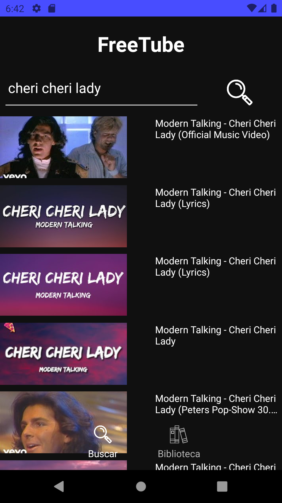
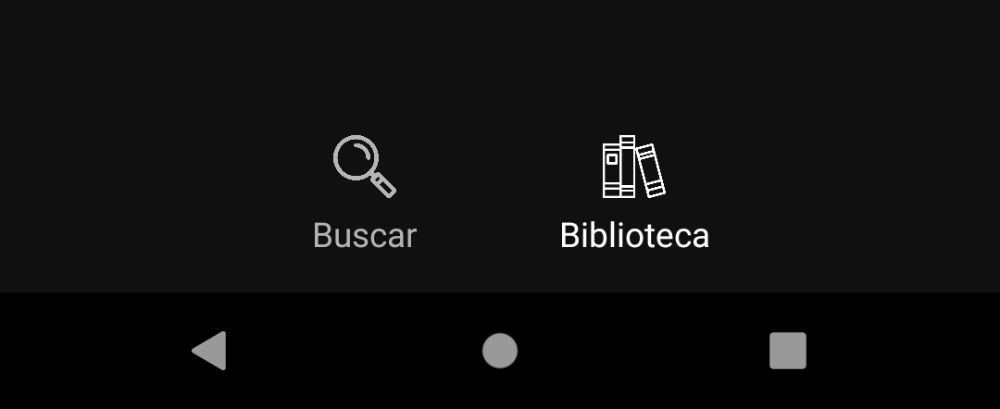
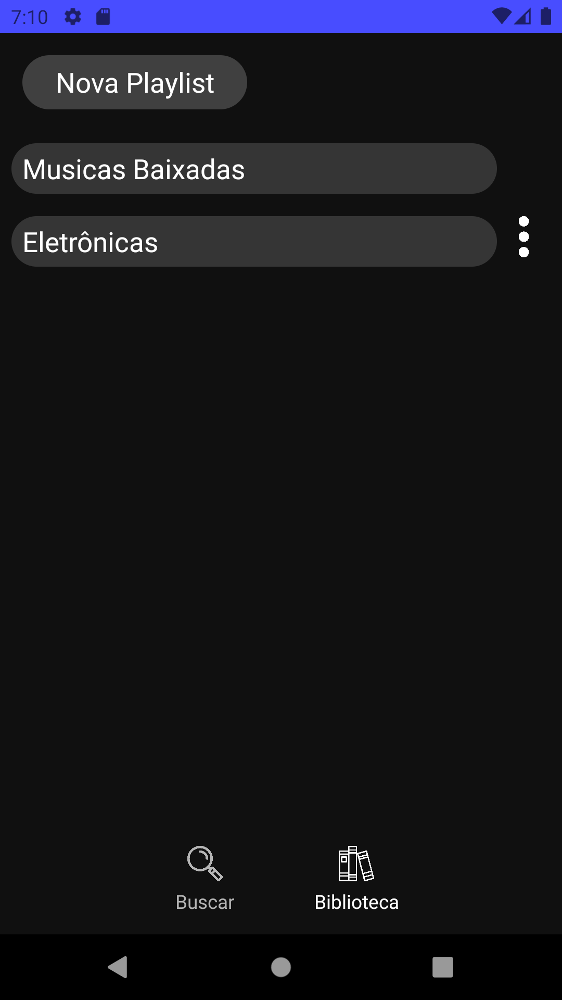
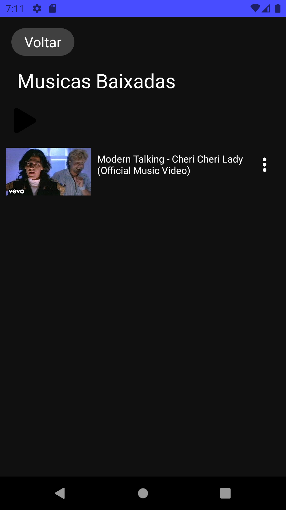
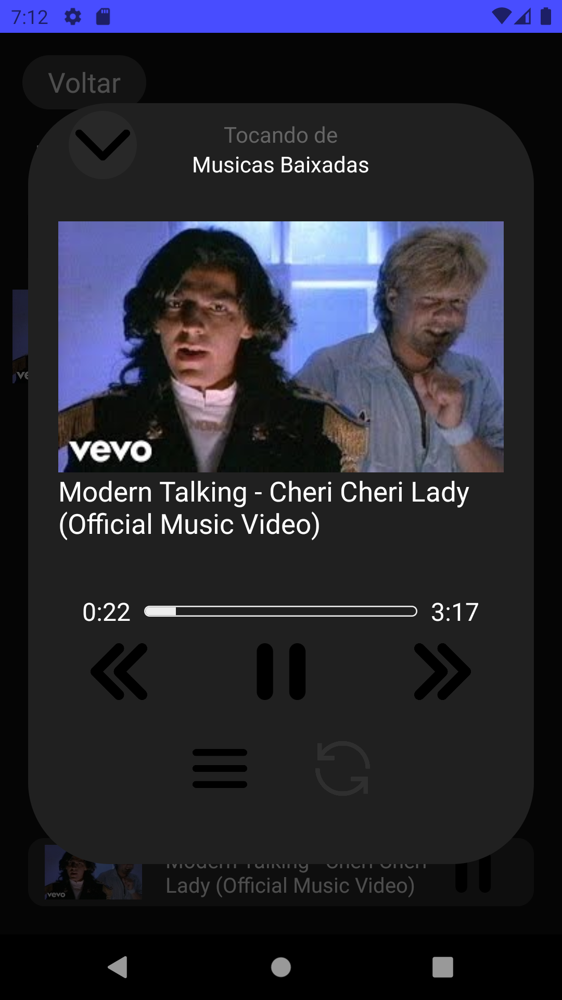

# Freetube

Este projeto tem como objetivo ser um aplicativo para download de musicas fácil e seguro. O aplicativo conta com a utilização de uma API como principal ferramenta de pesquisa e download dos videos fornecidos pelo YouTube. A API em questão é de minha autoria e pode ser encontrada em <a href="https://github.com/dudrt/Youtube_API">Youtube API</a>.

# 🔧 Este é um projeto que está em desenvolvimento. 
Atualmente estou trabalhando em suas funcionalidades e logo irei começar a trabalhar no desempenho e design do aplicativo.

# APLICATIVO NÃO ESTÁ MAIS FUNCIONANDO!

Devido a problemas com a API <a href="https://github.com/dudrt/Youtube_API">Youtube API</a> que era utilizada no aplicativo ele não é mais capaz de baixar nem pesquisar musicas. A mesma parou de funcionar graças ao local aonde era hospedado parar de aceitar este tipo de aplicação!
 
Futuro aplicativo parecido entrará desenvolvimento assim que for encontrado alguma API confiavel de download de musicas.

# TO-DO List

- Notificação para mostrar que está tocando. ❌ (Notificação da biblioteca com problemas)
- Fazer a parte do looping no menu da música. ✔
- Caso as músicas estejam sendo tocadas e uma delas for deletada, remover da fila. ✔
- Identificar se já existe uma música igual na playlist de baixados. ✔
- Ao terminar de tocar a playlist, modificar o estado de `MusicPlaying` para false. 

# Principais Informações
Este projeto está sendo feito *100%* por mim. 
Linguagem Utilizada: JavaScript  
Tecnologia Utilizada: React Native, CLI, 0.71.0  
Principal Biblioteca utilizada:<a href='https://rntp.dev'>Track Player</a>, 3.2.0

# Principais Funcionalidades

O aplicativo possui diversas funcionalidades e opções, deixando assim, caso fosse tudo abordado, um documento muito longo. Será então abordado as principais funções, as demais funcionalidades são padrões de qualquer Streaming de música. 

- <a href='#procurar-videos-do-youtube'>Procurar videos do Youtube</a>.
- <a href='#navegação-de-telas'>Navegação de Telas</a>.
- <a href='#criar-playlists'>Criar Playlists</a>.
- <a href='#dentro-da-playlist'>Dentro da Playlist</a>.
- <a href='#menu-da-música'>Menu da Música</a>.

# Procurar videos do Youtube
Este aplicativo tem como função principal buscar e fazer o download de videos do youtube. Para isso, você não precisa copiar o link do vídeo, basta pesquisar diretamente dentro do aplicativo e os 10 primeiros resultados serão mostrados na tela. 

 
# Baixar músicas
Após a procura do video ser feito, basta apenas clicar em cima da musica desejada e uma notificação na parte inferior da tela aparecerá.Esta notificação poderá ser de: 

`Esta música já foi baixada!`
`Música Salva!`
Caso a mensagem seja:
`Erro, entre em contato com o suporte!`
É possivel que seja algum problema de conexão a internet.

# Navegação de Telas

Para navegar entre telas é utilizado o menu inferior no qual um botão vai para a tela principal e o outro para a tela de playlists.  

# Criar Playlists

Na tela `Biblioteca` pode-se criar uma nova playlist clicando no botão `Nova Playlist`. 
Todas as músicas baixadas podem ser encontradas em `Musicas Baixadas`.  

 

# Dentro da Playlist

Ao entrar em uma playlist pode ser visto as músicas nela contidas e um botão em cima que irá rodar toda a playlist, ou então clicando em cima da musica, irá tocar a playlist partindo da música escolhida.  
 

# Menu da Música

Ao iniciar uma música, um menu na parte inferior da tela aparece, nele é possivel ver a imagem, nome da música e função pausar ou despausar, caso clicada, abre um menu, onde possui mais funções.  
 

